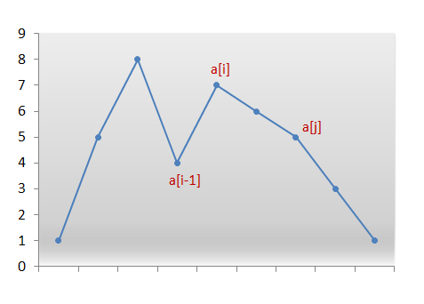

# 思路简记

## 301. Remove Invalid Parentheses

TODO

## 273. Integer to English Words

TODO

## 953. Verifying an Alien Dictionary

给你一个words list,和一个字母序，判断word list是否是sorted的。首先需要将字母序的string，转换成一个map&lt;character, integer&gt; , value 代表是字母的priority。然后比较adjacent words，如果前缀相同则 长度长者大。

```java
class Solution {
    public boolean isAlienSorted(String[] words, String order) {
        int[] map = new int[26];
        for(int i = 0; i < order.length(); i++){
            char c = order.charAt(i);
            map[c - 'a'] = i;
        }

        for(int i = 0; i < words.length - 1; i++){
            String word1 = words[i];
            String word2 = words[i + 1];
            int min = Math.min(word1.length(), word2.length());
            int j = 0;
            for(j = 0; j < min; j++){
                char c1 = word1.charAt(j);
                char c2 = word2.charAt(j);
                if(map[c1 - 'a'] > map[c2 - 'a']) return false;
                else if(map[c1 - 'a'] < map[c2 - 'a']) break;
            }
            if(j == min && word1.length() > word2.length()) return false;
        }
        return true;
    }
}
```

## 67. Add Binary

模拟题，对于长短不一的两个string的相加，建议使用两个指针，分别判断string的长度。还有stringbuilder直接append数字会把它转换成string

```java
class Solution {
    public String addBinary(String a, String b) {
        int al = a.length();
        int bl = b.length();
        int i = al - 1, j = bl - 1, carry = 0;
        StringBuilder sb = new StringBuilder();
        while(i >= 0 || j >= 0){
            int sum = carry;
            if(i >= 0) sum += a.charAt(i--) - '0';
            if(j >= 0) sum += b.charAt(j--) - '0';
            sb.append(sum % 2);
            carry = sum / 2;
        }
        if(carry != 0) sb.append(carry);
        return sb.reverse().toString();
    }
}
```

## 297. Serialize and Deserialize Binary Tree



## 253. Meeting Room II

```text
TODO
```

## 973. K Closet Points to Origin



## 238. Product Array Except Self

暴力解O\(n^2\)，其次可以用product数组。两个数组left, right。分别表示product of all the numbers to the left and all the numbers to the right of the index。 把左边的product乘以右边的product即可。但是这样空间复杂度是O\(n\)。我们可以利用output先存left的信息，然后再在构建right数组的时候直接算出结果。

```java
class Solution {
    public int[] productExceptSelf(int[] nums) {
        // left array
        // [1, 2, 6, 24]
        // right array
        // [24,24,12,4]
        int n = nums.length;
        int[] res = new int[n];
        res[0] = 1; 
        for(int i = 1; i < n; i++){
            res[i] = res[i - 1] * nums[i - 1];
        }
        
        int right = 1;
        for(int i = n - 1; i >= 0; i--){
            res[i] *= right;
            right *= nums[i];
        }
        return res;
    }
}
```

## 560. Subarray Sum Equals K



## 721.  Accounts Merge

本质上是把问题转换成一个graph，寻找联通量，并给其着色。build graph + dfs/bfs

```java
class Solution {
    public List<List<String>> accountsMerge(List<List<String>> accounts) {
        // each email is a node and the name of the owner is just the color of the node
        // we can build a graph based on these nodes.
        // by using dfs/bfs, we will find all the connected component and then color them aka assign them with a name.
        HashMap<String, HashSet<String>> graph = new HashMap<>();
        HashMap<String, String> color = new HashMap<>();
        for(List<String> account : accounts){
            String name = account.get(0);
            for(int i = 1; i < account.size(); i++){
                String cur = account.get(i);
                color.put(cur, name);
                if(!graph.containsKey(cur)) graph.put(cur, new HashSet<String>());
                if(i == 1) continue;
                String pre = account.get(i - 1);
                graph.get(cur).add(pre);
                graph.get(pre).add(cur);
            }
        }
        List<List<String>> res = new LinkedList<>();
        HashSet<String> visited = new HashSet<>();
        for(String node : graph.keySet()){
            if(visited.add(node)){
                List<String> list = new LinkedList<>();
                DFS(list, node, graph, visited);
                Collections.sort(list);
                list.add(0, color.get(node));
                res.add(list);
            }
        }
        return res;
    }

    public void DFS(List<String> list, String str, HashMap<String, HashSet<String>> graph, 
    HashSet<String> visited){
        list.add(str);
        for(String next : graph.get(str)){
            if(visited.add(next)){
                DFS(list, next, graph, visited);
            }
        }
    }
}
```

## 125. Valid Palindrome

注意两个点left一定要小于right，还有两个function

```java
Character.isLetterOrDigit(char c)
Character.toLowerCase(char c)
```

```java
class Solution {
    public boolean isPalindrome(String s) {
        if(s.equals("")) return true;
        int left = 0, right = s.length() - 1;
        while(left < right){
            while(left < right && !Character.isLetterOrDigit(s.charAt(left))) left++;
            while(left < right && !Character.isLetterOrDigit(s.charAt(right))) right--;
            if(Character.toLowerCase(s.charAt(left)) != Character.toLowerCase(s.charAt(right))){
                return false;
            }
            left++;
            right--;
        }
        return true;
    }
}
```

## 426.  Convert Binary Search Tree to Sorted Doubly Linked List



## 1. Two Sum

给予我微信名以尊重

```java
class Solution {
    public int[] twoSum(int[] nums, int target) {
        HashMap<Integer,Integer> map = new HashMap<>();
        for(int i = 0; i < nums.length; i++){
            int complement = target - nums[i];
            if(map.containsKey(complement)){
                return new int[]{map.get(complement), i};
            }
            map.put(nums[i], i);
        }
        throw new IllegalArgumentException("No two sum solution");
    }
}
```

## 158. Read N Characters Given Read4 II - Call multiple times

```text
TODO
```

## 278. First Bad Version

## 621. Task Scheduler

```text
TODO
```

## 523. Continuous Subarray Sum

O\(N\)的做法还是用prefix sum, 但是利用的一个公式 \(a + \(nk\)\) % k = a % k

需要注意处理sum = 0 的情况

```java
class Solution {
    public boolean checkSubarraySum(int[] nums, int k) {
        HashMap<Integer, Integer> map = new HashMap<>();
        int sum = 0;
        map.put(0, -1);
        for(int i = 0; i < nums.length; i++){
            sum += nums[i];
            if(k != 0) sum %= k;
            if(map.containsKey(sum)){
                if(i - 2 >= map.get(sum)){
                    return true;
                }
            } else{
                map.put(sum, i);
            }
        }
        return false;
    }
}
```

二分法

```java
public class Solution extends VersionControl {
    public int firstBadVersion(int n) {
        int left = 0;
        int right = n;
        while(left < right){
            int mid = left + (right - left) / 2;
            if(!isBadVersion(mid)){
                left = mid + 1;
            } else right = mid;
        }
        return left;
    }
}
```

## 621. Task Scheduler

```text
TODO
```

## 785. Is Graph Bipartite

给一个graph交替染色，用一个map来store每个node的颜色，在用DFS/BFS的过程中，终止条件发生在两个相邻的node同色。给个BFS的吧

```java
class Solution {
    public boolean isBipartite(int[][] graph) {
        int n = graph.length;
        int[] color = new int[n];
        Arrays.fill(color, - 1);
        // iterate every uncolored node in this graph
        // this is for disconnected component
        for(int i = 0; i < graph.length; i++){
            if(color[i] == -1){
                Queue<Integer> q = new LinkedList<>();
                color[i] = 0;
                q.offer(i);
                while(!q.isEmpty()){
                    Integer top = q.poll();
                    for(int nei : graph[top]){
                        if(color[nei] == -1){
                            q.offer(nei);
                            color[nei] = color[top] ^ 1;
                        } else if(color[nei] == color[top]) return false;
                    }
                }
            }
        }
        return true;
    }
}
```

## 282.  Expreesion Add Operators

```text
TODO
```

## 76. Minimum Window Substring

```java
class Solution {
    public String minWindow(String s, String t) {   
        HashMap<Character, Integer> map = new HashMap<>();
        for(char c : t.toCharArray()){
            map.put(c, map.getOrDefault(c, 0) + 1);
        }
        int count = map.size();
        int left = 0;
        int res = s.length() + 1;
        int index = 0;
        for(int right = 0; right < s.length(); right++){
            char c = s.charAt(right);
            if(map.containsKey(c)){
                map.put(c, map.get(c) - 1);
                if(map.get(c) == 0) count--;
            }
            while(count == 0){
                if(res > right - left + 1){
                    res = right - left + 1;
                    index = left;
                }
                char cc = s.charAt(left++);
                if(map.containsKey(cc)){
                    map.put(cc, map.get(cc) + 1);
                    if(map.get(cc) == 1) count++;
                }
            }
        }
        if(res == s.length() + 1){
            return "";
        } else{
            return s.substring(index, index + res);
        }
    }
}
```

## 173. Binary Search Tree Iterator

```java
class BSTIterator {
    Stack<TreeNode> stack;
    TreeNode cur = null;
    public BSTIterator(TreeNode root) {
        stack = new Stack();
        cur = root;
    }
    
    /** @return the next smallest number */
    public int next() {
        while(cur != null){
            stack.push(cur);
            cur = cur.left;
        }
        TreeNode top = stack.pop();
        cur = top.right;
        return top.val;
    }
    
    /** @return whether we have a next smallest number */
    public boolean hasNext() {
        return !stack.isEmpty() || cur != null;
    }
}
```

## 986. Interval List Intersections

two pointers

```java
class Solution {
    public int[][] intervalIntersection(int[][] A, int[][] B) {
        int max = Math.max(A.length, B.length);
        int[][] temp = new int[max * 2][2];
        int pa = 0;
        int pb = 0;
        int count = 0;
        while(pa < A.length && pb < B.length){
            int starta = A[pa][0];
            int startb = B[pb][0];
            int enda = A[pa][1];
            int endb = B[pb][1];
            int start = Math.max(starta, startb);
            int end = Math.min(enda, endb);
            if(start <= end){
                temp[count][0] = start;
                temp[count][1] = end;
                count++;
            }
            if(enda == end) pa++;
            if(endb == end) pb++;
        }
        int[][] res = new int[count][2];
        System.arraycopy(temp, 0, res, 0, count);
        return res;
    }
}
```

## 340. Longest Substring with At Most K Distinct Characters



## 438. Find All Anagrams in a String

```java
class Solution {
    public List<Integer> findAnagrams(String s, String p) {
        int[] map = new int[26];
        int count = 0;
        for(char c : p.toCharArray()){
            if(map[c - 'a']++ == 0) count++;
        }
        int left = 0;
        int right = 0;
        List<Integer> res = new ArrayList<>();
        while(right < s.length()){
            if(--map[s.charAt(right) - 'a'] == 0) count--;
            while(count == 0){
                if(right - left + 1 == p.length()){
                    res.add(left);
                }
                if(map[s.charAt(left++) - 'a']++ == 0) count++;
            }
            right++;
        }
        return res;
    }
}
```

## 124. Binary TreeMaximum Path Sum



## 199. Binary Tree Right Side View

1. BFS add the last one of the level to the result
2. DFS, reverse the preorder, check right substree first


## 825. Friends Of Appropriate Ages

counting sort idea

```java
class Solution {
    public int numFriendRequests(int[] ages) {
        int[] numinage = new int[121];
        int[] suminage = new int[121];
        int sum = 0;
        for(int age : ages){
            numinage[age]++;
        }
        for(int i = 1; i <= 120; i++){
            suminage[i] = suminage[i - 1] + numinage[i];
        }
        for(int i = 15; i <= 120; i++){
            int count = suminage[i] - suminage[i / 2 + 7];
            sum += count * numinage[i] - numinage[i];
        }
        return sum;
    }
}
```

## 349. Intersection of Two Arrays

1. use hashset O\(m + n\) O\(n\)
2. sort and use two pointer O\(nlogn\) O\(1\)
3. sort one and use binary search O\(nlogn\) O\(n\)

## 350. Intersection of Two Arrays II

```java
class Solution {
    public int[] intersect(int[] nums1, int[] nums2) {
        HashMap<Integer, Integer> map = new HashMap<>();
        for(int num : nums1){
            map.put(num, map.getOrDefault(num, 0) + 1);
        }
        int[] res = new int[nums1.length];
        int index = 0;
        for(int num : nums2){
            if(map.containsKey(num)){
                res[index++] = num;
                map.put(num, map.get(num) - 1);
                if(map.get(num) == 0) map.remove(num);
            }
        }
        return Arrays.copyOf(res, index);
    }
    
}
```

follow up : 

What if elements of nums2 are stored on disk, and the memory is limited such that you cannot load all elements into the memory at once?

* If only nums2 cannot fit in memory, put all elements of nums1 into a HashMap, read chunks of array that fit into the memory, and record the intersections.
* If both nums1 and nums2 are so huge that neither fit into the memory, sort them individually \(external sort\), then read 2 elements from each array at a time in memory, record intersections.

## 98. Validate Binary Search Tree

1. divide and conquer
2. iterative version of 1 need 3 stacks to store the node, left value and right value
3. inorder traversal

```java
class Solution {
    public boolean isValidBST(TreeNode root) {
        return isValid(root, null, null);
    }
    
    public boolean isValid(TreeNode node, Integer left, Integer right){
        if(node == null) return true;
        if(left != null && left >= node.val) return false;
        if(right != null && right <= node.val) return false;
        return isValid(node.left, left, node.val) && isValid(node.right, node.val, right);
    }
}
```

## 31. Next Permutation

这道题需要注意一个property：

lexicographically最小的permutation其实是ascending order

lexicographically最大的permutation其实是descending order

我一开始也是从右往左扫，找到第一个a\[i - 1\] &lt; a\[i\]，此时



只需要找到a\[i\]右边比a\[i-1\]大的最小的数，也就是要从右开始遍历至a\[i\]。因为a\[i\]到末尾已经是descending order了，当我们找到这个a\[j\]并将其与a\[i - 1\]替换后，其实没有必要sort a\[i:\]，只需要reverse一下就可以了

```java
class Solution {
    public void nextPermutation(int[] nums) {
        int n = nums.length;
        int i = n - 2;
        for(; i >= 0; i--){
            if(nums[i] < nums[i + 1]){
                for(int j = n - 1; j >= i + 1; j--){
                    if(nums[j] > nums[i]){
                        swap(nums, j, i);
                        break;
                    }
                }
                break;
            }
        }
        reverse(nums, i + 1, n - 1);
    }
    
    public void swap(int[] nums, int i, int j){
        int temp = nums[i];
        nums[i] = nums[j];
        nums[j] = temp;
    }
    
    public void reverse(int[] nums, int i, int j){
        while(i < j){
            swap(nums, i, j);
            i++;
            j--;
        }
    }
}
```

## 314. Binary Tree Vertical Order Traversal

```java
class Solution {
    public List<List<Integer>> verticalOrder(TreeNode root) {
        List<List<Integer>> res = new ArrayList<>();
        if(root == null) return res;
        Queue<TreeNode> queue = new LinkedList<>();
        Queue<Integer> cQueue = new LinkedList<>();
        TreeMap<Integer, List<Integer>> map = new TreeMap<>();
        queue.offer(root);
        cQueue.offer(0);
        while(!queue.isEmpty() && !cQueue.isEmpty()){
            for(int k = queue.size() - 1; k >= 0; k--){
                TreeNode top = queue.poll();
                int columns = cQueue.poll();
                map.putIfAbsent(columns, new ArrayList<>());
                map.get(columns).add(top.val);
                if(top.left != null){
                    queue.offer(top.left);
                    cQueue.offer(columns - 1);
                }
                if(top.right != null){
                    queue.offer(top.right);
                    cQueue.offer(columns + 1);
                }
            }
        }
        for(Integer key : map.keySet()){
            res.add(map.get(key));   
        }
        return res;
    }
}
```

## 896. Monotonic Array

one pass

```java
class Solution {
    public boolean isMonotonic(int[] A) {
        boolean inc = true, dec = true;
        for(int i = 1; i < A.length; i++){
            inc &= A[i] >= A[i - 1];
            dec &= A[i] <= A[i - 1];
        }
        return inc || dec;
    }
}
```

## 161. One Edit Distance

```java
class Solution {
    public boolean isOneEditDistance(String s, String t) {
        if(s.length() > t.length()) return isOneEditDistance(t, s);
        int slen = s.length();
        int tlen = t.length();
        if(Math.abs(slen - tlen) > 1) return false;
        int i = 0;
        while(i < slen){
            if(s.charAt(i) != t.charAt(i)){
                if(slen != tlen)
                    return s.substring(i).equals(t.substring(i + 1));
                else
                    return s.substring(i + 1).equals(t.substring(i + 1));
            }
            i++;
        }
        return slen + 1 == tlen;
    }
}
```

## 56. Merge Interval

按start sort， 遍历

## 958. Check Completeness of a Binary Tree

BFS 遇到null之后判断剩下的是不是全是null

## 88. Merge Sorted Array

merge from the end

System.arraycopy\(int\[\] start, int startpos, int\[\] end, int endpos, int length\)

## 42. Trapping Rain Water




## 689. Maximum Sum of  3 Non-Overlapping Subarrays

```text
// 太难了，让我缓缓
TODO
```

## 489. Robot Room Cleaner

backtracking , 需要tracking robot的方向

```java
class Solution {
    // up : 0, right: 90, down 180, left:270
    public void cleanRoom(Robot robot) {
        Set<String> set = new HashSet<>();
        backtracking(robot, set, 0, 0, 0);
    }
    
    
    public void backtracking(Robot robot, Set<String> set, int i, int j, int dirc){
        String str = i + "->" + j;
        if(!set.add(str)) return;
        robot.clean();
        for(int k = 0; k < 4; k++){
            int x = i;
            int y = j;
            if(robot.move()){
                switch(dirc){
                    case 0: x--; break;
                    case 90: y++; break;
                    case 180: x++; break;
                    case 270: y--; break;
                }
                backtracking(robot, set, x, y, dirc);
                robot.turnLeft();
                robot.turnLeft();
                robot.move();
                robot.turnRight();
                robot.turnRight();
            }
            
            robot.turnRight();
            dirc += 90;
            dirc %= 360;
        }
    }
}
```

## 314. Shortest Distance from all Buildings

这个题一开始我想的是从0 BFS 到每一个 1，其实应该反过来。假设0有m个，1有n个，从0到 1，走的次数是m\(k + n\), 从1到0，则是n\*m。这个K是average的从0到1的distance。也就是说，我们多出来了一个mk。大大降低了我们的速度。如果使用0到1，我们需要记录下所有building到每个house的distance，用累加得到的distance\[i\]\[j\]来表示。同样需要一个数组reached, 来表示该0能被多少building reached。

优化的话，当0不能被之前的building访问到，那么我们永远也不访问它，并把它设为2。因为如果有1个house能够访问所有的building，那么这个联通量包含了所有的1和部分的0。其实这些部分的0也是可以访问到所有的1。所以当0不能访问所有的1时，它既不可能作为house也不可能成为house 到 building的path中一部分。

```java
class Solution {
    int[][] directions = new int[][]{{-1, 0}, {1, 0}, {0, 1},{0, -1}};
    int reached = 0;
    boolean flag = false;
    public int shortestDistance(int[][] grid) {
        int count = 0;
        int shortest = Integer.MAX_VALUE;
        int m = grid.length;
        int n = grid[0].length;
        int[][] dist = new int[m][n];
        int[][] reached = new int[m][n];
        for(int i = 0; i < m; i++)
            for(int j = 0; j < n; j++){
                if(grid[i][j] == 1) count++;
            }
        flag = false;
        for(int i = 0; i < m; i++)
            for(int j = 0; j < n; j++){
                if(grid[i][j] == 1){
                    BFS(grid, dist, reached, i, j, count);
                    flag = true;
                }
            }
        for(int i = 0; i < m; i++){
            for(int j = 0; j < n; j++){
                if(grid[i][j] == 0 && reached[i][j] == count) 
                    shortest = Math.min(shortest, dist[i][j]);
            }
        }
        return shortest == Integer.MAX_VALUE ? -1 : shortest;
    }
    
    public void BFS(int[][] grid, int[][] dist, int[][] reached, int i, int j, int count){
        int[][] visited = new int[grid.length][grid[0].length];
        Queue<int[]> q = new LinkedList<>();
        q.offer(new int[]{i, j});
        visited[i][j] = 1;
        int step = 0;
        while(!q.isEmpty()){
            for(int k = q.size(); k > 0; k--){
                int[] top = q.poll();
                int row = top[0];
                int col = top[1];
                if(grid[row][col] == 0){
                    dist[row][col] += step;
                    reached[row][col]++;
                    if(flag && reached[row][col] == 0){
                        grid[row][col] = 2; 
                        continue;
                    }
                }
                for(int[] direction : directions){
                    int x = row + direction[0];
                    int y = col + direction[1];
                    if(x < 0 || x >= grid.length || y < 0 || y >= grid[0].length || grid[x][y] != 0 || visited[x][y] == 1) continue;
                    q.offer(new int[]{x, y});
                    visited[x][y] = 1;
                }
            }
            step++;
        }
    }
}
```

## 133. Clone Graph

```java
class Solution {
    public Node cloneGraph(Node node) {
        if(node == null) return null;
        HashMap<Node, Node> map = new HashMap<>();
        DFS(node, map, new HashSet<>());
        return map.get(node);
    }
    
    public void DFS(Node node, HashMap<Node, Node> map, Set<Node> set){
        if(!set.add(node)){
            return;
        }
        Node copy = new Node(node.val, new ArrayList<>());
        map.put(node, copy);
        for(Node next : node.neighbors){
            DFS(next, map, set);
            copy.neighbors.add(map.get(next));
        }
    }
}
```

## 885. Spiral Matrix III

simulation，重点在于发现规律，当向左或者向右移动时，步数加一

```java
class Solution {
    public int[][] spiralMatrixIII(int R, int C, int r0, int c0) {
        // simulation
        int[][] dirt = new int[][]{{0, 1}, {1, 0}, {0, -1}, {-1, 0}};
        int step = 0;
        int d = 0;
        int r = r0, c = c0;
        List<int[]> res = new ArrayList<>();
        res.add(new int[]{r0, c0});
        int count = 1;
        while(count < R * C){
            // important
            if(d == 0 || d == 2) step++;
            for(int i = 0; i < step; i++){
                r += dirt[d][0];
                c += dirt[d][1];
                if(r >= 0 && r < R && c >= 0 && c < C){
                    res.add(new int[]{r, c});
                    count++;
                }
            }
            d = (d + 1) % 4;
        }
        return res.toArray(new int[R * C][2]);
    }
}
```

